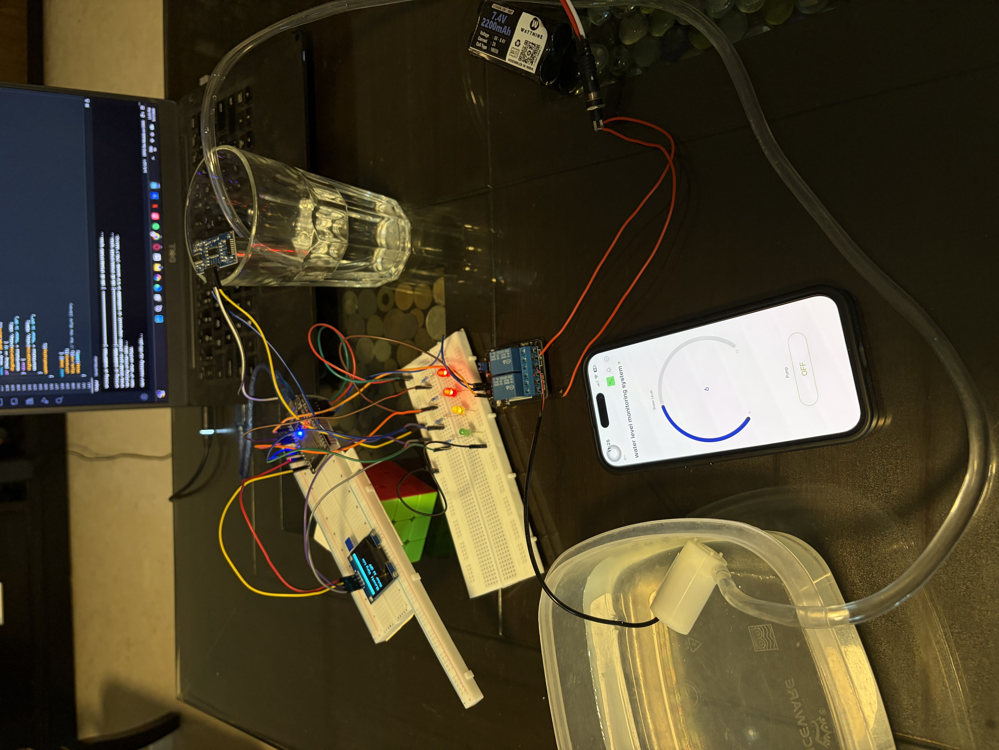
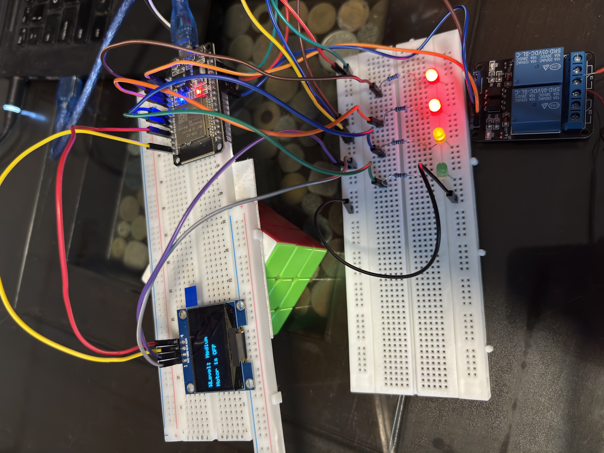
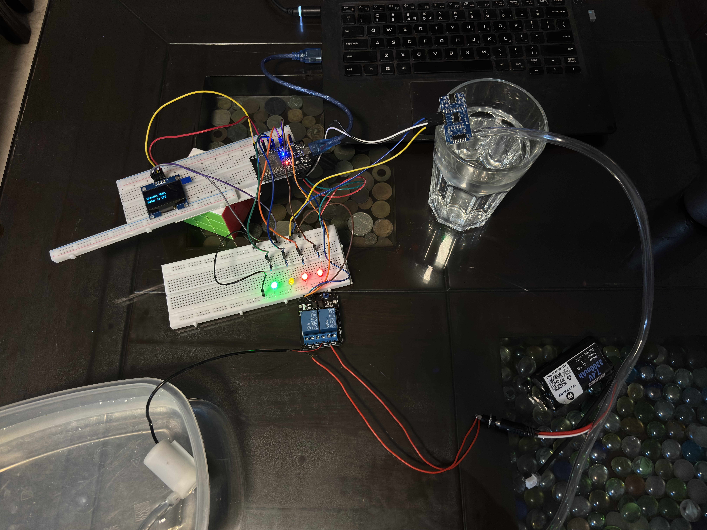
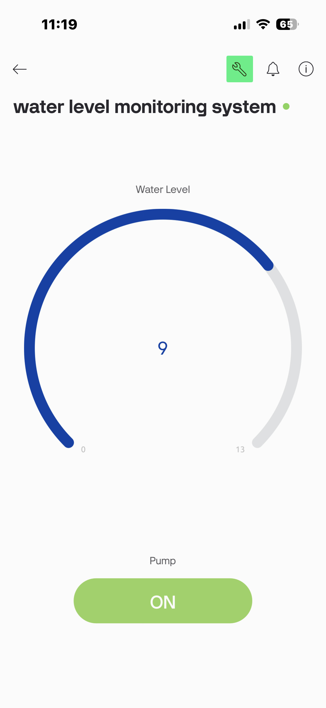

# ESP32 Water Level Monitoring System

An IoT-based water tank monitoring and control system built with an ESP32, an ultrasonic sensor, and the Blynk app. It tracks the water level in real time, lights up LEDs based on how full the tank is, shows live status on an OLED display, and lets you turn a water pump on/off remotely from your phone.

I built this loosely based on an online tutorial, but ended up swapping out most of the components for what I actually had on hand — a different OLED, different resistor values, a different relay module, no adapter, a different battery setup. That meant rewriting a good chunk of the code and doing a fair bit of hardware debugging along the way rather than just wiring things up and calling it done. Details below.



## What it does

- Measures water level using an HC-SR04 ultrasonic sensor
- Displays the live water level and pump status on a 1.3" OLED screen
- Lights up 4 LEDs (green → yellow → red → red) as the tank empties, and vice versa as it fills back up — giving a quick visual read of the level either way.
- Sends live water level data to the Blynk app dashboard
- Lets you switch the water pump on/off remotely through a relay, controlled from the Blynk app



## Components used

| Component | Notes |
|---|---|
| ESP32 Dev Board | Main controller |
| HC-SR04 Ultrasonic Sensor | Measures distance to water surface |
| 1.3" OLED Display (SH1106, I2C) | Original tutorial used a 16x2 LCD + I2C module — I had this OLED instead, so I rewrote the display logic using the u8g2 library |
| 2-Channel 30VDC Relay Module | Original used a 5VDC 1-channel relay — used only 1 of the 2 channels here |
| 4x LEDs (2 red, 1 yellow, 1 green) | Water level indicators |
| 220Ω Resistors x4 | Original used 180Ω — 220Ω works fine, just slightly dimmer LEDs |
| Mini submersible water pump | Pumps water when the relay switches on |
| 7.4V 2200mAh Li-ion battery pack | Powers the pump — equivalent to the 2x 3.7V cells the original tutorial used |
| 2x 840-point breadboards | One for the ESP32 + OLED, one for the LED/sensor/relay wiring |
| Jumper wires | Used in place of a dedicated ESP32 adapter |

## Circuit overview



- HC-SR04 trig/echo → GPIO 12 / GPIO 13
- OLED SDA/SCL → GPIO 21 / GPIO 22 (I2C)
- Relay IN1 → GPIO 14
- LEDs → GPIO 2, 4, 5, 18
- Relay switches the pump's positive line, sourced from the 7.4V battery pack

The relay's VCC/JD-VCC pins are bridged with the onboard jumper cap and powered from the ESP32's VIN pin — running it off 3.3V wasn't enough current for the coil to switch reliably.

## The build process (and what actually went wrong)

Swapping in different parts than the original tutorial meant nothing quite worked out of the box. A few of the bigger issues along the way:

- **OLED instead of LCD** meant switching libraries entirely — from `LiquidCrystal_I2C` to `u8g2`, and rewriting the whole display update logic since u8g2 works on a draw-buffer-and-send model instead of directly printing to cursor positions.
- **A loose ground connection** on the breadboard caused a cascading mess at one point — LEDs lighting up dimly and simultaneously instead of individually (classic ground-fault ghosting), and the OLED not showing anything at all. Isolating one LED on a clean row with fresh wiring was what finally revealed it was a wiring issue, not a code or driver problem.
- **Relay coil clicking/chattering** turned out to be a VCC current issue — moved the relay's power from 3.3V to the ESP32's VIN (5V) pin to fix it.
- **OLED glitching when the motor switched on/off** — the relay's coil draws a current spike on switching, which was enough to disturb the shared power rail and corrupt the I2C display buffer momentarily.
- Also hit **Blynk's free-tier monthly message cap** partway through testing — added a `delay(1000)` in the main loop afterward so it doesn't spam updates constantly.

## Blynk App



The app shows the live water level on a gauge (0–13, matched to my tank depth) and has a switch to control the pump remotely.

## Code

The full sketch is in [`waterlevel_monitor.ino`](waterlevel_monitor.ino). WiFi credentials and the Blynk auth token are left as placeholders — fill in your own before uploading:

```cpp
char ssid[] = "YOUR_WIFI_SSID";
char pass[] = "YOUR_WIFI_PASSWORD";
#define BLYNK_AUTH_TOKEN "YOUR_BLYNK_AUTH_TOKEN"
```

## Setup

1. Install the ESP32 board package in Arduino IDE
2. Install the **U8g2** (by oliver) and **Blynk** libraries via Library Manager
3. Set your `MaxLevel` variable to match your tank's depth in cm
4. Fill in your WiFi credentials and Blynk auth token
5. Upload and power the board

---

I followed a tutorial as a starting point, but didn't stick to it exactly — different screen, different components, and a fair amount of figuring things out on my own along the way. Happy to hear feedback or suggestions.
